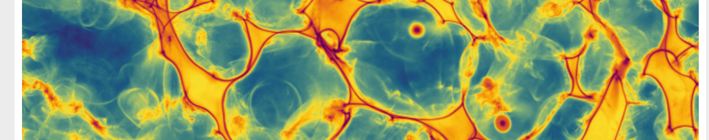

# Jaxions



Jaxions is a grid-based massively parallel code to study the Axion field evolution before, around and after the QCD phase transition.
 
## Requirements

To compile the code and run a typical simulation you will need the following libraries:

- Working C/C++ compilers (for GNU version 4.x or later)
- CMake tools ([CMake](https://cmake.org/))
- GNU Scientific Library ([GSL](https://www.gnu.org/software/gsl/))
- Fastest Fourier Transform in the West ([FFTW3](http://www.fftw.org/)) 
- Hierarchical Data Format ([HDF5](https://www.hdfgroup.org/solutions/hdf5/))
- Message Passing Interface (MPI), version 3.0 or higher. Examples are [Intel-MPI](https://www.intel.com/content/www/us/en/developer/tools/oneapi/mpi-library.html), [OpenMPI](https://www.open-mpi.org/), [MPICH](https://www.mpich.org/) 

## Installation

To install the code clone the repository 
```
git clone https://github.com/veintemillas/jaxions.git; cd jaxions
```
Then you can use cmake to build the code
```
mkdir build; cd build
cmake -S ../jaxions -B .
cmake --build build -j<n_procs>
```
The deafult branch is 'redondo', this might change in the future. 

## Documentation

A documentation is under development. For reference on the physics implemented, please refer to the main paper:

- *A. Vaquero, J. Redondo, J. Stadler*, Early seeds of axion miniclusters, [1809.09241](https://arxiv.org/abs/1809.09241) 
